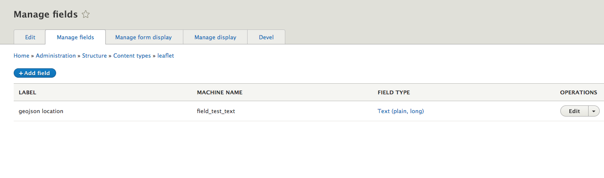
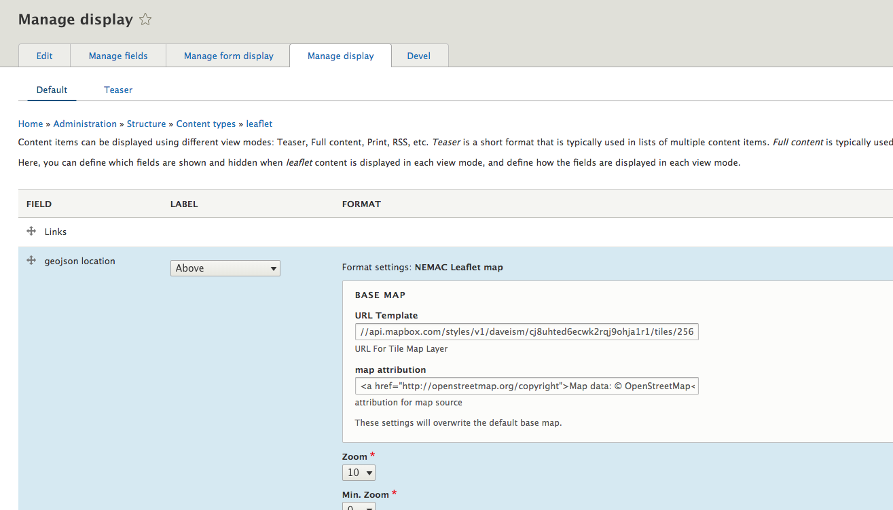
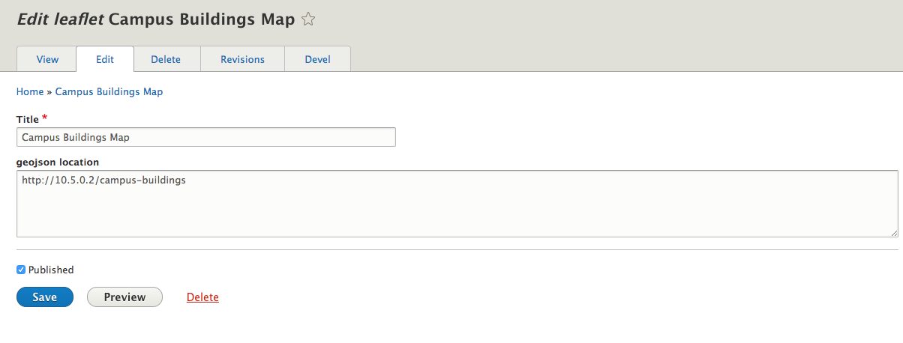

## NEMAC Leaflet

This module provides Drupal 8 integration with Leaflet map scripting library,
http://leafletjs.com/.

To use it you must download the leaflet JS library from either
http://leafletjs.com/download.html or
GitHub, https://github.com/Leaflet/Leaflet

It was based on the https://www.drupal.org/project/leaflet module.

### Installation
---
* Download the code from GitHub https://github.com/nemac/nemac_leaflet_drupal/archive/master.zip.

* Unzip the file and copy the contents to .your Drupal 8 sites `/html/modules/contrib` directory.

* Then install the module with Drupal's UI

### Using
---

* Add a `Text (plain, long)` field to your Drupal content.

* Go to your Manage Display tab.

* Change the format  to NEMAC Leaflet Map.

* Change the base map by editing the settings.

* to change the GeoJSON layer add the URL without the http: or https: in the text field

